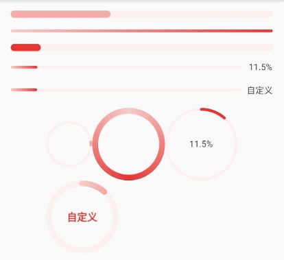

# flutter_progress

进度条组件，支持线形状和环形进度条

## 使用示例



```dart
class _MyHomePageState extends State<MyHomePage> {
  double percent = 0;
  @override
  void initState() {
    super.initState();
    Timer.periodic(Duration(milliseconds: 1000), (timer) {
      setState(() {
        if (percent == 100) {
          percent = 0;
        } else {
          percent = percent >= 90 ? 100 : percent + 10;
        }
      });
    });
  }

  @override
  Widget build(BuildContext context) {
    return Scaffold(
      appBar: AppBar(
        title: Text(widget.title),
      ),
      body: Padding(
        padding: EdgeInsets.all(16),
        child: Column(
          children: [
            Progress(
              strokeWidth: 10,
              trailColor: Color.fromRGBO(253, 241, 240, 1),
              colors: [
                Color.fromRGBO(247, 206, 200, 1),
                Color.fromRGBO(226, 60, 57, 1),
              ],
            ),
            SizedBox(
              height: 16,
            ),
            Progress(
              percent: 100,
              showInfo: false,
              trailColor: Color.fromRGBO(253, 241, 240, 1),
              colors: [
                Color.fromRGBO(247, 206, 200, 1),
                Color.fromRGBO(226, 60, 57, 1),
              ],
            ),
            SizedBox(
              height: 16,
            ),
            Progress(
              strokeWidth: 10,
              percent: percent,
              showInfo: false,
              trailColor: Color.fromRGBO(253, 241, 240, 1),
              strokeColor: Color.fromRGBO(226, 60, 57, 1),
            ),
            SizedBox(
              height: 16,
            ),
            Progress(
              percent: percent,
              trailColor: Color.fromRGBO(253, 241, 240, 1),
              colors: [
                Color.fromRGBO(247, 206, 200, 1),
                Color.fromRGBO(226, 60, 57, 1),
              ],
            ),
            SizedBox(
              height: 16,
            ),
            Progress(
              percent: percent,
              trailColor: Color.fromRGBO(253, 241, 240, 1),
              colors: [
                Color.fromRGBO(247, 206, 200, 1),
                Color.fromRGBO(226, 60, 57, 1),
              ],
              infoBuilder: (percent) {
                return Padding(
                  padding: EdgeInsets.only(
                    left: 8,
                  ),
                  child: Text(
                    '自定义',
                    style: TextStyle(
                      fontSize: 12,
                    ),
                  ),
                );
              },
            ),
            SizedBox(
              height: 16,
            ),
            Wrap(
              crossAxisAlignment: WrapCrossAlignment.center,
              children: [
                Progress(
                  size: Size.square(64),
                  type: ProgressType.circle,
                  trailColor: Color.fromRGBO(253, 241, 240, 1),
                  colors: [
                    Color.fromRGBO(247, 206, 200, 1),
                    Color.fromRGBO(226, 60, 57, 1),
                  ],
                ),
                Progress(
                  percent: 100,
                  type: ProgressType.circle,
                  trailColor: Color.fromRGBO(253, 241, 240, 1),
                  strokeWidth: 8,
                  colors: [
                    Color.fromRGBO(247, 206, 200, 1),
                    Color.fromRGBO(226, 60, 57, 1),
                    Color.fromRGBO(247, 206, 200, 1),
                  ],
                  showInfo: false,
                ),
                Progress(
                  percent: percent,
                  type: ProgressType.circle,
                  trailColor: Color.fromRGBO(253, 241, 240, 1),
                  strokeColor: Color.fromRGBO(226, 60, 57, 1),
                ),
                Progress(
                  percent: percent,
                  strokeWidth: 8,
                  type: ProgressType.circle,
                  trailColor: Color.fromRGBO(253, 241, 240, 1),
                  colors: [
                    Color.fromRGBO(247, 206, 200, 1),
                    Color.fromRGBO(226, 60, 57, 1),
                    Color.fromRGBO(247, 206, 200, 1),
                  ],
                  infoBuilder: (percent) {
                    return Text(
                      '自定义',
                      style: TextStyle(
                        fontSize: 14,
                        fontWeight: FontWeight.bold,
                        color: Color.fromRGBO(226, 60, 57, 1),
                      ),
                    );
                  },
                ),
              ],
            ),
          ],
        ),
      ),
    );
  }
}
```

